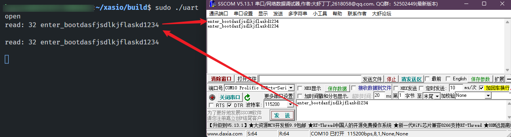

# learn_non_boost_asio
non-Boost Asio: UDP, Serial-Port, SocketCAN, Multicast, UDS

* [learn_non_boost_asio](#learn_non_boost_asio)
   * [关于](#关于)
   * [第一个程序](#第一个程序)
      * [环境](#环境)
      * [文件目录](#文件目录)
      * [CMakeLists.txt](#cmakeliststxt)
      * [first.cpp](#firstcpp)
      * [编译运行](#编译运行)
      * [封装一下](#封装一下)
   * [UDP](#udp)
      * [Shell 收发UDP数据流](#shell-收发udp数据流)
      * [CMakeLists.txt](#cmakeliststxt-1)
      * [udpc.cpp](#udpccpp)
      * [测试](#测试)
   * [UART Serial_Port](#uart-serial_port)
      * [WSL2使用USB串口](#wsl2使用usb串口)
      * [给当前用户永久串口读写权限](#给当前用户永久串口读写权限)
      * [CMakeLists.txt](#cmakeliststxt-2)
      * [uart.cpp](#uartcpp)
      * [测试](#测试-1)
   * [SocketCAN](#socketcan)
      * [vxcan.sh](#vxcansh)
      * [CMakeLists.txt](#cmakeliststxt-3)
      * [can.cpp](#cancpp)
      * [CANFD测试](#canfd测试)
   * [Multicast](#multicast)
      * [默认示例](#默认示例)
      * [CMakeLists.txt](#cmakeliststxt-4)
      * [multicast_tx.cpp](#multicast_txcpp)
      * [multicast_rx.cpp](#multicast_rxcpp)
      * [测试](#测试-2)
   * [Unix Domain Socket](#unix-domain-socket)
      * [CMakeLists.txt](#cmakeliststxt-5)
      * [unix_socket_tx.cpp](#unix_socket_txcpp)
      * [unix_socket_rx.cpp](#unix_socket_rxcpp)
      * [测试](#测试-3)
   * [Github learn_non_boost_asio](#github-learn_non_boost_asio)

## 关于

目前(20220713)是 1.22.1 版本:

- 主页: [Asio C++ Library (think-async.com)](https://think-async.com/Asio/index.html)
- 单独使用Asio, 不依赖Boost: [Standalone Asio (think-async.com)](https://think-async.com/Asio/AsioStandalone.html)
- [Asio and Boost.Asio (think-async.com)](https://think-async.com/Asio/AsioAndBoostAsio.html)
- [Asio Doc(think-async.com)](https://think-async.com/Asio/asio-1.22.1/doc/)
- [Using Asio with C++11](http://www.open-std.org/jtc1/sc22/wg21/docs/papers/2012/n3388.pdf)

> Asio是一个用于网络和低级I/O编程的跨平台C++库，它使用现代C++方法为开发人员提供了一致的异步模型。当面向C++11（或更高版本）时，大多数Asio可以在没有任何额外依赖的情况下使用。

传感器等的数据接入方式多种多样: `UDP, 串口, SocketCAN, 组播, UDS`等... 下面就罗列一下最最基本的Asio接入.  

## 第一个程序

### 环境

- WSL2, Ubuntu18, 5.10.60.1
- GCC 7.5.0, 支持C++ 17及以下
- CMake Version 3.10.2
- Asio-1.22.1

参考: [C++ Standards Support in GCC - GNU Project](https://gcc.gnu.org/projects/cxx-status.html)

### 文件目录

简单的实现2s后打印, 文件目录

```bash
├── CMakeLists.txt
├── asio-1.22.1		# 解压后的asio文件夹
└── src
    └── first.cpp
```

### CMakeLists.txt

```cmake
cmake_minimum_required(VERSION 3.5)

project(first LANGUAGES CXX)

set(CMAKE_CXX_STANDARD 11)
set(CMAKE_CXX_STANDARD_REQUIRED ON)
set(ASIO_INCLUDE_DIR ${CMAKE_CURRENT_SOURCE_DIR}/asio-1.22.1/include)

add_executable(first 
    src/first.cpp
)

target_compile_options(first PUBLIC -DASIO_STANDALONE)
target_include_directories(first PUBLIC ${ASIO_INCLUDE_DIR})
target_link_libraries(first PUBLIC pthread)

```

### first.cpp

传入了一个参数count

```c++
#include <iostream>
#include <asio.hpp>

void print(const asio::error_code &ec, int * n)
{
    std::cout << *n << std::endl;
}

int main()
{
    int count = 2;
    asio::io_context io;
    asio::steady_timer t(io, asio::chrono::seconds(2));
    t.async_wait([&](const asio::error_code &ec) {
        std::cout << "xxxx" << std::endl;
        print(ec, &count);
    });
    std::cout << "print run after 2s..." << std::endl;
    io.run();
    std::cout << "program exit" << std::endl;
    return 0;
}
```

### 编译运行

```bash
mkdir build && cd build
cmake ..
make -j12
./first
# print run after 2s...
# xxxx
# 2
# program exit
```

### 封装一下

```c++
#include <iostream>
#include <asio.hpp>

class first
{
public:
    first(asio::io_context &io_context)
        : time_(io_context, std::chrono::seconds(2)),
          count_{2}
    {
        time_.async_wait(
            [this](asio::error_code ec) {
                if (!ec) {
                    this->handle_wait();
                }
            });
    }
    ~first()
    {
        std::cout << "~first()" << std::endl;
    }

    void handle_wait()
    {
        std::cout << count_ << std::endl;
    }

private:
    asio::steady_timer time_;
    int count_;
};

int main(int argc, const char **argv)
{
    asio::io_context io_context;
    first f(io_context);
    io_context.run();
    return 0;
}
```

运行

```c++
2
~first()
```

## UDP

### Shell 收发UDP数据流

```bash
# 接收打印lo网口8080端口的UDP数据
sudo tcpdump -X -i lo -nnn udp port 8080

# 发送UDP数据到 本地8080端口
(echo "hello")| nc -u 127.0.0.1 8080
```

参考:

- [tcpdump: Learning how to read UDP packets - DZone Big Data](https://dzone.com/articles/tcpdump-learning-how-read-udp)
- [使用netcat(nc命令)发送udp包_gerrylon007的博客-CSDN博客_nc发送udp包](https://blog.csdn.net/butterfly5211314/article/details/89674577)
- [Linux nc命令 | 菜鸟教程 (runoob.com)](https://www.runoob.com/linux/linux-comm-nc.html)

### CMakeLists.txt

```cmake
cmake_minimum_required(VERSION 3.5)

set(CMAKE_CXX_STANDARD 11)
set(CMAKE_CXX_STANDARD_REQUIRED ON)
set(ASIO_INCLUDE_DIR ${CMAKE_CURRENT_SOURCE_DIR}/asio-1.22.1/include)

project(udpc LANGUAGES CXX)
add_executable(udpc 
    src/udpc.cpp
)
target_include_directories(udpc PUBLIC ${ASIO_INCLUDE_DIR})
target_link_libraries(udpc PUBLIC pthread)

```

### udpc.cpp

把收发揉一块, 发送两帧UDP数据, 打印接收

```c++
#include <iostream>
#include <asio.hpp>

class udpc
{
public:
    udpc(asio::io_context &io_context, const std::string &host, const std::string &port)
        : socket_(io_context, asio::ip::udp::endpoint(asio::ip::udp::v4(), std::stoi(port))),
          resolver_(io_context),
          host_(host),
          port_(port)
    {
        asio::ip::udp::resolver::query query(host_, port_);
        sender_endpoint_ = *resolver_.resolve(query);
        send("udpc begin receive");
        receive();
    }
    ~udpc()
    {
        std::cout << "~udpc()" << std::endl;
    }

    void send(const std::string &msg)
    {
        socket_.async_send_to(asio::buffer(msg), sender_endpoint_, [this](asio::error_code ec, std::size_t) {});
    }

    void receive()
    {
        socket_.async_receive_from(asio::buffer(recv_buffer_), sender_endpoint_, [this](asio::error_code ec, std::size_t len) {
            if (!ec) {
                recv_buffer_[len] = '\0';
                std::cout << &recv_buffer_[0] << std::endl;
                receive();
            }
        });
    }

private:
    asio::ip::udp::socket socket_;
    asio::ip::udp::resolver resolver_;
    asio::ip::udp::endpoint sender_endpoint_;
    std::string host_;
    std::string port_;
    char recv_buffer_[1600];
};

int main(int argc, const char **argv)
{
    if (argc != 3)
    {
        std::cerr << "Usage: udpc <host> <port>\n";
        return 1;
    }
    asio::io_context io_context;
    udpc client(io_context, argv[1], argv[2]);
    client.send("second send");
    io_context.run();
    return 0;
}
```

### 测试

```bash
sudo tcpdump -X  -i lo -nnn udp port 8080
./udpc 127.0.0.1 8080
echo "123" | nc -u 127.0.0.1 8080
```

测试如图


## UART Serial_Port

### WSL2使用USB串口

参考:

- [连接 USB 设备 | Microsoft Docs](https://docs.microsoft.com/zh-cn/windows/wsl/connect-usb)
- [Ubuntu18系统 PL2303GT驱动安装及绑定_家家的快乐空间的博客-CSDN博客](https://blog.csdn.net/m0_38144614/article/details/116614056)

操作

```bash
# Win11图标右键 -> Windows终端(管理员)
$ usbipd wsl list
BUSID  VID:PID    DEVICE                                                        STATE
5-2    067b:2303  Prolific USB-to-Serial Comm Port (COM14)                      Not attached
5-4    067b:2303  Prolific USB-to-Serial Comm Port (COM3)                       Not attached

# 把COM14附到Ubuntu(两个WSL2: Ubuntu和Ubuntu-18.04)
$ usbipd wsl attach -d Ubuntu-18.04 --busid 5-2

#####################################################

# Ubuntu-18.04, VID_067B & PID_2303 就是指的 PL2303
$ lsusb
Bus 001 Device 005: ID 067b:2303 Prolific Technology, Inc. PL2303 Serial Port

$ uname -a
Linux DESKTOP-N0N0EQI 5.10.60.1-microsoft-standard-WSL2

# WSL2需要从源码编译安装驱动
wget https://prolificusa.com/app/uploads/2019/06/PL2303G_Linux_Driver_v1.0.4.zip
unzip PL2303G_Linux_Driver_v1.0.4.zip
cd PL2303G_Linux_Driver_v1.0.4/5.2_ok

# 改Makefile加上install
obj-m   += pl2303.o
all:
	make -C /lib/modules/$(shell uname -r)/build M=$(PWD) modules
install:
	sudo insmod pl2303.ko;\
	sudo mkdir -p /lib/modules/$(shell uname -r)/kernel/drivers/usb/serial;\
	sudo cp pl2303.ko /lib/modules/$(shell uname -r)/kernel/drivers/usb/serial;\
	sudo sh -c 'echo "pl2303" >> /etc/modules-load.d/modules.conf'
clean:
	make -C /lib/modules/$(shell uname -r)/build M=$(PWD) clean
	
# 编译安装
make all
make install

# 检验
$ ls /dev/ttyUSB*
/dev/ttyUSB0
```

连接如图


WSL2里面使用Minicom测试, Windows使用SSCOM

```bash
# WSL2
sudo minicom -b 115200 -D /dev/ttyUSB0
```

测试如图


### 给当前用户永久串口读写权限

一般操作 /dev 设备都需要 sudo, 如:

- 串口设备 `/dev/ttyUSB*, /dev/ttyS*, /dev/ttyACM*` 等, 
- SPI设备: `/dev/spidev*`

如果不想用sudo

```bash
# 临时
sudo chmod 777 /dev/ttyUSB0

# 永久
$ ls -l /dev/ttyUSB0 
crwxrwxrwx 1 root root 188, 0 Jul 15 10:20 /dev/ttyUSB0
## 将当前用户加入188左边的root用户组, aG: append groups
$ sudo usermod -aG root $(whoami)
$ sudo reboot

# 测试, 不需要sudo了
minicom -b 115200 -D /dev/ttyUSB0
```

### CMakeLists.txt

```bash
cmake_minimum_required(VERSION 3.5)

set(CMAKE_CXX_STANDARD 11)
set(CMAKE_CXX_STANDARD_REQUIRED ON)
set(ASIO_INCLUDE_DIR ${CMAKE_CURRENT_SOURCE_DIR}/asio-1.22.1/include)

project(uart LANGUAGES CXX)
add_executable(uart 
    src/uart.cpp
)
target_include_directories(uart PUBLIC ${ASIO_INCLUDE_DIR})
target_link_libraries(uart PUBLIC pthread)
```

### uart.cpp

参考 [Serial Ports (think-async.com)](https://think-async.com/Asio/asio-1.22.2/doc/asio/overview/serial_ports.html)

> Asio 包括用于以可移植方式创建和操作串行端口的类 serial_port, 还包括用于配置端口波特率、流控制类型、奇偶校验、停止位和字符大小的选项类。一旦打开，串行端口可以用作[流](https://think-async.com/Asio/asio-1.22.2/doc/asio/overview/core/streams.html)。

串口数据有很多种:

- 定长数据, 靠Header或Tailer来分帧
- 不定长数据, 一般靠 Header/Tailer + 指示长度的字节 来分帧
- 靠空闲中断来分帧(MCU常用)
- ...

上位机没有像MCU那样的空闲中断来分包, 比如发`Hello`, 可能第一次读出2字节He, 再读出来3字节llo. 所以, 串口操作确实要麻烦一点, 还要手动拼起来, 再分出帧后解析.  

这里简单演示一下以 `\n` 判断帧结束的一种方式. 读阻塞, 写异步, 把读到的原封不动写出去. 设备是 `/dev/ttyUSB0`, 波特率115200. 

```bash
#include <asio.hpp>
#include <iostream>

int main(int argc, char* argv[]) {
	asio::io_context io_context;

	asio::serial_port s(io_context, "/dev/ttyUSB0", 115200);
	if (s.is_open()) {
		s.close();
		std::cout << "open" << std::endl;
	} else {
		std::cout << "close" << std::endl;
	}
	s.open("/dev/ttyUSB0");

	std::vector<char> frame;
	while (true) {
		char data[256];
		int n = s.read_some(asio::buffer(data));
		for (int i = 0; i < n; i++) {
			frame.push_back(data[i]);
			if (data[i] == '\n') {
				std::cout << "read: " << frame.size() << " ";
				for (int i = 0; i < frame.size(); i++) {
					std::cout << frame[i];
				}
				std::cout << std::endl;
				s.async_write_some(asio::buffer(frame),
					[](const std::error_code& ec, std::size_t bytes_transferred) {
						std::cout << "write: " << bytes_transferred << std::endl;
					});
				frame.clear();
			}
		}
	}
	s.close();
	return 0;
}
```

备忘: 异步读可用 `async_read_some`

### 测试

```bash
sudo ./uart
```

如图



## SocketCAN

WSL2 对 SocketCAN, VXCAN的支持参见前作:

- [WSL2内核编译_添加SocketCAN支持_weifengdq的博客-CSDN博客_wsl内核](https://blog.csdn.net/weifengdq/article/details/121663897)

### vxcan.sh

这里用`vxcan`来测试, 脚本 `vxcan.sh`, 生成一对 vxcan

```bash
#!/bin/sh
# for WSL2
sudo modprobe can_raw
sudo modprobe vxcan

# 如果 ip link 中存在 vcan0, 就删除 vcan0
if ip link show vcan0 > /dev/null 2>&1; then
    sudo ip link set dev vcan0 down
    sudo ip link set dev vxcan0 down
    sudo ip link delete dev vcan0 type vcan
fi

sudo ip link add dev vcan0 type vxcan
sudo ip link set up vcan0
sudo ip link set dev vxcan0  up
```

### CMakeLists.txt

```cmake
cmake_minimum_required(VERSION 3.5)

set(CMAKE_CXX_STANDARD 11)
set(CMAKE_CXX_STANDARD_REQUIRED ON)
set(ASIO_INCLUDE_DIR ${CMAKE_CURRENT_SOURCE_DIR}/asio-1.22.1/include)

project(can LANGUAGES CXX)
add_executable(can 
    src/can.cpp
)
target_include_directories(can PUBLIC ${ASIO_INCLUDE_DIR})
target_link_libraries(can PUBLIC pthread)
```

### can.cpp

参考: 

- [Stream-Oriented File Descriptors (think-async.com)](https://think-async.com/Asio/asio-1.22.2/doc/asio/overview/posix/stream_descriptor.html)
- [can-utils/cansend.c at master · linux-can/can-utils (github.com)](https://github.com/linux-can/can-utils/blob/master/cansend.c)
- [HubertD/socketcan_asio (github.com)](https://github.com/HubertD/socketcan_asio)
- [canary/raw.cpp at master · djarek/canary (github.com)](https://github.com/djarek/canary/blob/master/tests/raw.cpp)

```c++
#include <asio.hpp>
#include <iostream>
#include <linux/can.h>
#include <linux/can/raw.h>
#include <net/if.h>
#include <stdio.h>
#include <stdlib.h>
#include <string.h>
#include <sys/ioctl.h>
#include <sys/socket.h>
#include <sys/types.h>
#include <unistd.h>

int main(int argc, char* argv[]) {
	asio::io_context io_context;
	asio::posix::stream_descriptor stream(io_context,
	                                      ::socket(PF_CAN, SOCK_RAW, CAN_RAW));
	struct ifreq ifr;
	strcpy(ifr.ifr_name, "vcan0");
	ioctl(stream.native_handle(), SIOCGIFINDEX, &ifr);
	struct sockaddr_can addr;
	addr.can_family = AF_CAN;
	addr.can_ifindex = ifr.ifr_ifindex;
	// https://github.com/linux-can/can-utils/blob/master/cansend.c
	// switch to CAN FD mode
	int enable_canfd = 1;
	if (setsockopt(stream.native_handle(), SOL_CAN_RAW, CAN_RAW_FD_FRAMES,
	               &enable_canfd, sizeof(enable_canfd))) {
		printf("error when enabling CAN FD support\n");
		return 1;
	}
	bind(stream.native_handle(), (struct sockaddr*)&addr, sizeof(addr));

	struct canfd_frame frame = {
	    .can_id = 0x12345678 | CAN_EFF_FLAG,
	    .len = 64,
	    .flags = 3,
	    .__res0 = 0,
	    .__res1 = 0,
	    .data = {0x01, 0x02, 0x03, 0x04, 0x05, 0x06, 0x07, 0x08, 0x09, 0x0a,
	             0x0b, 0x0c, 0x0d, 0x0e, 0x0f, 0x10, 0x11, 0x12, 0x13, 0x14,
	             0x15, 0x16, 0x17, 0x18, 0x19, 0x1a, 0x1b, 0x1c, 0x1d, 0x1e,
	             0x1f, 0x20, 0x21, 0x22, 0x23, 0x24, 0x25, 0x26, 0x27, 0x28,
	             0x29, 0x2a, 0x2b, 0x2c, 0x2d, 0x2e, 0x2f, 0x30, 0x31, 0x32,
	             0x33, 0x34, 0x35, 0x36, 0x37, 0x38, 0x39, 0x3a, 0x3b, 0x3c,
	             0x3d, 0x3e, 0x3f, 0x41}};
	// write(stream.native_handle(), &frame, sizeof(frame));
	stream.write_some(asio::buffer(&frame, sizeof(frame)));

	struct canfd_frame rframe;
	// read(stream.native_handle(), &rframe, sizeof(rframe));
	stream.read_some(asio::buffer(&rframe, sizeof(rframe)));
	if (rframe.can_id & CAN_EFF_FLAG) {
		printf("RX %08X ", rframe.can_id & CAN_EFF_MASK);
	} else {
		printf("RX %03X ", rframe.can_id & CAN_SFF_MASK);
	}
	printf("%c %c [%d]", (rframe.flags & CANFD_BRS) ? 'B' : '-',
	       (rframe.flags & CANFD_ESI) ? 'E' : '-', rframe.len);
	for (int i = 0; i < rframe.len; i++) {
		printf(" %02X", rframe.data[i]);
	}
	printf("\n");

	io_context.run();

	return 0;
}
```

备忘:

- 看代码像是硬套原生SocketCAN
- async_read_some, async_write_some
- 可否用 [Support for Other Protocols (think-async.com)](https://think-async.com/Asio/asio-1.22.2/doc/asio/overview/networking/other_protocols.html)

### CANFD测试

```bash
./can
candump -td -x any
cansend vxcan0 125##3.10.11.12.13.14.15.16.17.18.19
```


vxcan0发送会内部触发vcan0接收, 然后vcan0发出去. CANFD收发没有问题

## Multicast

### 默认示例

其实asio默认包含有组播的例子

- `asio-1.22.1/src/examples/cpp11/multicast/sender.cpp`
- `/home/karoto/xasio/asio-1.22.1/src/examples/cpp11/multicast/receiver.cpp`

端口是 `30001`, 运行

```bash
# 接收
./receiver 0.0.0.0 239.255.0.1
# 或 
# ./receiver 239.255.0.1 239.255.0.1

# 发送 Message 0~9, 10s后自动退出
./sender 239.255.0.1
```

参考 [组播的时候到底该如何绑定网卡_王林森linux的博客-CSDN博客](https://blog.csdn.net/yansen_2010/article/details/38982309)

- linux上组播接收不能绑定在物理网卡地址, 不然收不到任何信息
- 绑定0.0.0.0以收取所有的组播消息
- 绑定组播地址以收取发到这个组播地址的消息

下面把端口也加进参数, 贴出来

### CMakeLists.txt

```cmake
cmake_minimum_required(VERSION 3.5)

set(CMAKE_CXX_STANDARD 11)
set(CMAKE_CXX_STANDARD_REQUIRED ON)
set(ASIO_INCLUDE_DIR ${CMAKE_CURRENT_SOURCE_DIR}/asio-1.22.1/include)

project(multicast_rx LANGUAGES CXX)
add_executable(multicast_rx 
    src/multicast_rx.cpp
)
target_include_directories(multicast_rx PUBLIC ${ASIO_INCLUDE_DIR})
target_link_libraries(multicast_rx PUBLIC pthread)

project(multicast_tx LANGUAGES CXX)
add_executable(multicast_tx 
    src/multicast_tx.cpp
)
target_include_directories(multicast_tx PUBLIC ${ASIO_INCLUDE_DIR})
target_link_libraries(multicast_tx PUBLIC pthread)
```

### multicast_tx.cpp

```c++
#include "asio.hpp"
#include <iostream>
#include <sstream>
#include <string>

class multicast_tx {
public:
	multicast_tx(asio::io_context& io_context,
	             const asio::ip::address& multicast_address,
	             const short multicast_port)
	    : endpoint_(multicast_address, multicast_port)
	    , socket_(io_context, endpoint_.protocol())
	    , timer_(io_context) {
		do_send();
	}

private:
	void do_send() {
		socket_.async_send_to(asio::buffer(data_), endpoint_, 
        [this](std::error_code ec, std::size_t len) {
			if (!ec) {
				do_timeout();
			}
        });
	}

	void do_timeout() {
		timer_.expires_after(std::chrono::seconds(1));
		timer_.async_wait([this](std::error_code ec) {
			if (!ec)
				do_send();
		});
	}

	asio::ip::udp::socket socket_;
	asio::ip::udp::endpoint endpoint_;
	asio::steady_timer timer_;
	std::array<char, 1024> data_ {'a', 'b', 'c', 'd', 'e'};
};

int main(int argc, const char** argv) {
	if(argc != 3) {
		std::cerr << "Usage: multicast_tx <multicast_address> <multicast_port>\n";
		return 1;
	}
	asio::io_context io_context;
	multicast_tx s(io_context, asio::ip::make_address(argv[1]), std::stoi(argv[2]));
	io_context.run();
    return 0;
}
```

### multicast_rx.cpp

```c++
#include "asio.hpp"
#include <array>
#include <iostream>
#include <string>

class receiver {
public:
	receiver(asio::io_context& io_context,
	         const asio::ip::address& listen_address,
	         const asio::ip::address& multicast_address,
	         const short multicast_port)
	    : socket_(io_context) {
		// Create the socket so that multiple may be bound to the same address.
		asio::ip::udp::endpoint listen_endpoint(listen_address, multicast_port);
		socket_.open(listen_endpoint.protocol());
		socket_.set_option(asio::ip::udp::socket::reuse_address(true));
		socket_.bind(listen_endpoint);

		// Join the multicast group.
		socket_.set_option(asio::ip::multicast::join_group(multicast_address));

		do_receive();
	}

private:
	void do_receive() {
		socket_.async_receive_from(
		    asio::buffer(data_), sender_endpoint_,
		    [this](std::error_code ec, std::size_t length) {
			    if (!ec) {
				    std::cout.write(data_.data(), length);
				    std::cout << std::endl;

				    do_receive();
			    }
		    });
	}

	asio::ip::udp::socket socket_;
	asio::ip::udp::endpoint sender_endpoint_;
	std::array<char, 1024> data_;
};

int main(int argc, char* argv[]) {
	if (argc != 4) {
		std::cerr << "Usage: receiver <listen_address> <multicast_address> "
		             "<multicast_port>\n";
		return 1;
	}

	asio::io_context io_context;
	receiver r(io_context, asio::ip::make_address(argv[1]),
	           asio::ip::make_address(argv[2]), std::stoi(argv[3]));
	io_context.run();

	return 0;
}
```

### 测试

```bash
./multicast_tx 239.255.0.1 30001
./multicast_rx 239.255.0.1 239.255.0.1 30001
```


Wireshark抓包


## Unix Domain Socket

号称比`127.0.0.1`更优秀的性能

参考: 

- [本机网络 IO 之 Unix Domain Socket 性能分析 - 知乎 (zhihu.com)](https://zhuanlan.zhihu.com/p/448373622)
- [UNIX Domain Sockets (think-async.com)](https://think-async.com/Asio/asio-1.22.2/doc/asio/overview/posix/local.html)
- [UNIX domain socket tutorial (systemprogrammingatntu.github.io)](https://systemprogrammingatntu.github.io/mp2/unix_socket.html)
- [网络协议之:socket协议详解之Unix domain Socket - 知乎 (zhihu.com)](https://zhuanlan.zhihu.com/p/493855698)

官方的UDS示例代码文件夹: `asio-1.22.1/src/examples/cpp11/local`

### CMakeLists.txt

```cmake
cmake_minimum_required(VERSION 3.5)

set(CMAKE_CXX_STANDARD 11)
set(CMAKE_CXX_STANDARD_REQUIRED ON)
set(ASIO_INCLUDE_DIR ${CMAKE_CURRENT_SOURCE_DIR}/asio-1.22.1/include)

project(unix_socket_tx LANGUAGES CXX)
add_executable(unix_socket_tx 
    src/unix_socket_tx.cpp
)
target_include_directories(unix_socket_tx PUBLIC ${ASIO_INCLUDE_DIR})
target_link_libraries(unix_socket_tx PUBLIC pthread)

project(unix_socket_rx LANGUAGES CXX)
add_executable(unix_socket_rx 
    src/unix_socket_rx.cpp
)
target_include_directories(unix_socket_rx PUBLIC ${ASIO_INCLUDE_DIR})
target_link_libraries(unix_socket_rx PUBLIC pthread)
```

### unix_socket_tx.cpp

每秒发出 `abcde`

```c++
#include "asio.hpp"
#include <iostream>

class unix_socket_tx {
public:
	unix_socket_tx(asio::io_context& io_context, const std::string& path)
	    : endpoint_(asio::local::stream_protocol::endpoint(path))
	    , socket_(io_context)
	    , timer_(io_context) {
		do_connect();
	}

private:
	void do_connect() {
		socket_.async_connect(endpoint_, [this](std::error_code ec) {
			if (!ec) {
				do_write();
			} else {
				std::cout << "Error 1: " << ec.message() << "\n";
			}
		});
	}
	void do_write() {
		socket_.async_write_some(
		    asio::buffer(data_),
		    [this](std::error_code ec, std::size_t /*size*/) {
			    if (!ec) {
				    do_timeout();
			    } else {
				    std::cout << "Error 2: " << ec.message() << "\n";
			    }
		    });
	}
	void do_timeout() {
		timer_.expires_after(std::chrono::seconds(1));
		timer_.async_wait([this](std::error_code ec) {
			if (!ec) {
				do_write();
			} else {
				std::cout << "Error 3: " << ec.message() << "\n";
			}
		});
	}
	asio::local::stream_protocol::endpoint endpoint_;
	asio::local::stream_protocol::socket socket_;
	asio::steady_timer timer_;
	std::array<char, 1024> data_{'a', 'b', 'c', 'd', 'e'};
};

int main(int argc, const char** argv) {
	try {
		if (argc != 2) {
			std::cerr << "Usage: " << argv[0] << " <path>\n";
			return 1;
		}
		asio::io_context io_context;
		unix_socket_tx s(io_context, argv[1]);
		io_context.run();
	} catch (std::exception& e) {
		std::cerr << "Exception: " << e.what() << "\n";
	}

	return 0;
}
```

### unix_socket_rx.cpp

```c++
#include "asio.hpp"
#include <iostream>

class unix_socket_rx {
public:
	unix_socket_rx(asio::io_context& io_context, const std::string& path)
	    : endpoint_(asio::local::stream_protocol::endpoint(path))
	    , acceptor_(io_context, endpoint_)
	    , socket_(io_context) {
		// unlink(path.c_str());
		do_accept();
	}

private:
	void do_accept() {
		acceptor_.async_accept(socket_, [this](std::error_code ec) {
			if (!ec) {
				do_read();
			} else {
				std::cout << "Error 1: " << ec.message() << "\n";
			}
		});
	}
	void do_read() {
		socket_.async_read_some(
		    asio::buffer(data_), [this](std::error_code ec, std::size_t len) {
			    if (!ec) {
				    std::cout << std::string(data_.data(), len)
				              << " len:" << len << "\n";
				    do_read();
			    } else {
				    std::cout << "Error 2: " << ec.message() << "\n";
			    }
		    });
	}
	asio::local::stream_protocol::endpoint endpoint_;
	asio::local::stream_protocol::acceptor acceptor_;
	asio::local::stream_protocol::socket socket_;
	std::array<char, 1024> data_;
};

int main(int argc, const char** argv) {
	if (argc != 2) {
		std::cerr << "Usage: " << argv[0] << " <path>\n";
		return 1;
	}
	asio::io_context io_context;
	std::remove(argv[1]); // existing file is removed
	unix_socket_rx s(io_context, argv[1]);
	io_context.run();
	return 0;
}
```

### 测试

```bash
# 先打开acceptor, 绑定一个路径
./unix_socket_rx /tmp/foobar

# 再打开发送, 连接到相应路径
./unix_socket_tx /tmp/foobar

# 任何一个被C掉, 另一个也会被拖累停掉
```


## Github learn_non_boost_asio

[weifengdq/learn_non_boost_asio: non-Boost Asio: UDP, Serial-Port, SocketCAN, Multicast, UDS (github.com)](https://github.com/weifengdq/learn_non_boost_asio)
